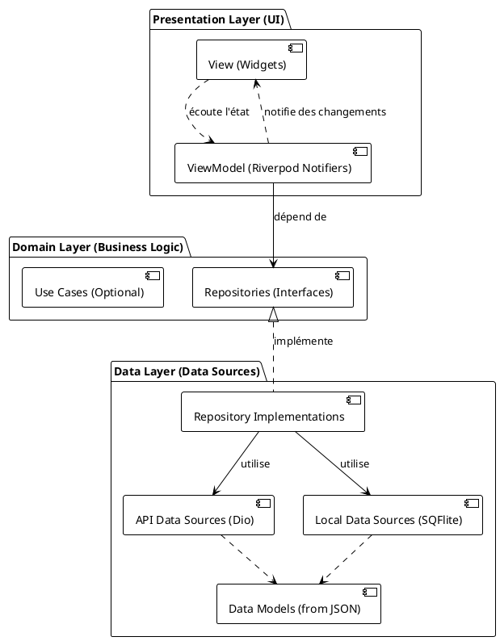

### **Livrable 3 : Dossier de Conception Technique et d'Architecture**

**Nom du Projet :** ProxiElec  
**Version du Document :** 1.0  
**Date :** 17 septembre 2025  
**État :** Finalisé

---

#### **Table des Matières**
1.  [Architecture Logicielle](#1-architecture-logicielle)
    *   1.1. Modèle Architectural : MVVM avec Repository Pattern
    *   1.2. Diagramme d'Architecture en Couches
    *   1.3. Flux de Données et de Contrôle
    *   1.4. Justification des Choix Technologiques
2.  [Conception de la Base de Données Locale](#2-conception-de-la-base-de-données-locale)
    *   2.1. Rôle de la Base de Données
    *   2.2. Modèle Logique des Données (MLD)
    *   2.3. Schéma Physique de la Base de Données (SQLite)
3.  [Conception des Interfaces et Contrats API](#3-conception-des-interfaces-et-contrats-api)
    *   3.1. Contrat d'Interface du Repository
    *   3.2. Contrat avec l'API Externe (Google Places)
4.  [Gestion des Dépendances et de l'État](#4-gestion-des-dépendances-et-de-létat)

---

### **1. Architecture Logicielle**

#### **1.1. Modèle Architectural : MVVM avec Repository Pattern**

L'application sera structurée selon le modèle **MVVM (Model-View-ViewModel)**. Ce choix est motivé par sa parfaite adéquation avec les frameworks UI déclaratifs comme Flutter. Il favorise une séparation claire des préoccupations, améliore la testabilité et la maintenabilité du code.

*   **View (Vue) :**
    *   **Rôle :** Afficher l'état fourni par le ViewModel et notifier ce dernier des interactions de l'utilisateur.
    *   **Composition :** Uniquement des Widgets Flutter (ex: `MapScreen`, `DetailsBottomSheet`). La vue est "passive" et ne contient aucune logique métier.
    *   **Implémentation :** `ConsumerWidget` ou `ConsumerStatefulWidget` de Riverpod.

*   **ViewModel (Modèle de Vue) :**
    *   **Rôle :** Servir de pont entre la Vue et le Modèle. Il contient la logique de présentation et l'état de l'UI.
    *   **Composition :** Classes `StateNotifier` ou `AsyncNotifier` (Riverpod) qui exposent un état (`state`). Il interagit avec le Repository pour obtenir et traiter les données.
    *   **Implémentation :** `MapViewModel` qui gère l'état de l'écran principal.

*   **Model (Modèle) :**
    *   **Rôle :** Gérer les données de l'application et la logique métier. Il est représenté par le **Repository Pattern**.
    *   **Composition :**
        *   **Repositories :** Agissent comme une façade et une source de vérité unique pour les ViewModels (`PointDeVenteRepository`).
        *   **Data Sources (Sources de Données) :** Gèrent la communication avec les sources externes (`PlacesApiDataSource`, `LocalCacheDataSource`).
        *   **Data Models :** Classes Dart pures représentant les entités (`PointDeVente`).

#### **1.2. Diagramme d'Architecture en Couches**


#### **1.3. Flux de Données et de Contrôle**
1.  **Interaction Utilisateur :** L'utilisateur interagit avec un widget (ex: `FloatingActionButton`).
2.  **Notification :** La Vue appelle une méthode sur le ViewModel (ex: `viewModel.recenterMap()`).
3.  **Logique de Présentation :** Le ViewModel exécute la logique. Si des données sont nécessaires, il appelle une méthode du Repository (ex: `repository.getPoints(...)`).
4.  **Abstraction des Données :** Le Repository décide de la stratégie à adopter : appeler l'API, lire le cache, ou les deux.
5.  **Accès aux Données :** La (ou les) Source(s) de Données appropriée(s) est/sont appelée(s).
6.  **Retour des Données :** Les données remontent le chemin : `DataSource` -> `Repository` -> `ViewModel`.
7.  **Mise à Jour de l'État :** Le ViewModel traite les données reçues et met à jour sa propriété `state`.
8.  **Reconstruction de l'UI :** Riverpod notifie la Vue que l'état a changé. La Vue se reconstruit pour refléter le nouvel état.

#### **1.4. Justification des Choix Technologiques**
| Technologie           | Choix                 | Justification                                                                                                                                                                 |
| :-------------------- | :-------------------- | :---------------------------------------------------------------------------------------------------------------------------------------------------------------------------- |
| **Framework UI**      | Flutter               | Permet un développement multiplateforme (iOS/Android) rapide avec une base de code unique, des performances natives et une grande flexibilité de l'interface utilisateur.       |
| **Gestion d'État**    | Riverpod              | Solution robuste, sécurisée à la compilation (compile-safe) et découplée de l'arbre des widgets. Facilite l'injection de dépendances et la testabilité des ViewModels et services. |
| **Routage**           | `Navigator 2.0` / `go_router` | (Pour V2) Solution robuste pour la navigation complexe. Pour la V1, le Navigator de base suffira.                                                                        |
| **Appels Réseau**     | `dio`                 | Client HTTP puissant pour Dart. Offre des intercepteurs (pour le logging, l'ajout de tokens), la gestion des erreurs et une configuration simple des requêtes.                  |
| **Base de Données**   | `sqflite` + `Drift`   | `sqflite` est le standard pour SQLite sur Flutter. `Drift` est un ORM qui ajoute une couche de sécurité des types (type-safety) et génère du code boilerplate, réduisant les erreurs. |

### **2. Conception de la Base de Données Locale**

#### **2.1. Rôle de la Base de Données**
La base de données SQLite locale a deux objectifs principaux :
1.  **Cache :** Conserver les derniers points de vente récupérés pour un affichage quasi-instantané au lancement de l'application ou en cas de perte de connexion.
2.  **Évolutivité :** Préparer le terrain pour des fonctionnalités futures telles que la mise en favoris de points de vente.

#### **2.2. Modèle Logique des Données (MLD)**
Le MLD est la traduction du MCD en un modèle relationnel, proche de l'implémentation.
*   **POINT_DE_VENTE** (`id_point_vente`, `nom`, `adresse`, `latitude`, `longitude`, `horaires`, `#id_type_pv`)
*   **TYPE_POINT_VENTE** (`id_type_pv`, `libelle_type`)
*   **SERVICE** (`id_service`, `nom_service`)
*   **OFFRIR** (`#id_point_vente`, `#id_service`)

#### **2.3. Schéma Physique de la Base de Données (SQLite)**
Pour la V1, nous utiliserons une table dénormalisée pour la simplicité et la performance. La relation plusieurs-à-plusieurs "OFFRIR" sera gérée en stockant une liste sérialisée en JSON.

```sql
CREATE TABLE points_de_vente (
    id TEXT PRIMARY KEY,          -- Corresponds au place_id de Google
    nom TEXT NOT NULL,
    adresse TEXT NOT NULL,
    latitude REAL NOT NULL,
    longitude REAL NOT NULL,
    type TEXT NOT NULL,           -- Stocke la valeur de l'enum, ex: 'AGENCE_PAIEMENT'
    horaires TEXT,
    services_json TEXT,           -- Liste de services sérialisée en JSON, ex: '["Paiement", "Conseil"]'
    date_cache INTEGER NOT NULL   -- Timestamp Unix de la dernière mise à jour
);
```

### **3. Conception des Interfaces et Contrats API**

#### **3.1. Contrat d'Interface du Repository**
Le ViewModel dépendra de cette abstraction, pas de son implémentation.
```dart
// lib/domain/repositories/point_de_vente_repository.dart

abstract class PointDeVenteRepository {
  /// Récupère la liste des points de vente pour une zone géographique donnée.
  /// La méthode doit gérer la stratégie de récupération (API-first, cache-fallback).
  ///
  /// Peut lever une [NetworkException] ou une [CacheException].
  Future<List<PointDeVente>> getPointsInArea(MapBounds bounds);

  /// Récupère les détails spécifiques d'un point de vente par son ID.
  /// (Utile pour des données non fournies par la recherche de proximité).
  Future<PointDeVenteDetails> getPointDetails(String pointId); // Pour V2
}
```

#### **3.2. Contrat avec l'API Externe (Google Places)**
L'application interagira principalement avec l'endpoint **Nearby Search**.
*   **URL de base :** `https://maps.googleapis.com/maps/api/place/nearbysearch/json`
*   **Paramètres de Requête Obligatoires :**
    *   `location`: `double,double` (ex: `48.858370,2.294481`)
    *   `radius`: `integer` (en mètres)
    *   `key`: `string` (votre clé d'API)
*   **Paramètres Optionnels Clés :**
    *   `type`: `string` (ex: `car_repair`, `store`, etc. - à affiner pour trouver les bonnes correspondances)
    *   `keyword`: `string` (ex: `borne de recharge`, `agence électrique`)
*   **Champs Attendus dans la Réponse JSON :**
    *   `results[].place_id`
    *   `results[].name`
    *   `results[].vicinity` (adresse simplifiée)
    *   `results[].geometry.location.lat`
    *   `results[].geometry.location.lng`

### **4. Gestion des Dépendances et de l'État**
*   **Injection de Dépendances :** Riverpod sera utilisé pour l'injection de dépendances. Les `providers` seront déclarés pour chaque service, datasource et repository. Par exemple, le `MapViewModel` recevra une instance de `PointDeVenteRepository` via son constructeur, fournie par Riverpod.
    ```dart
    final pointDeVenteRepositoryProvider = Provider<PointDeVenteRepository>((ref) {
      return PointDeVenteRepositoryImpl(
        apiDataSource: ref.watch(apiDataSourceProvider),
        localDataSource: ref.watch(localDataSourceProvider),
      );
    });
    ```
*   **Gestion de l'État :** L'état de l'UI sera modélisé par des classes immuables (avec `copyWith`) pour garantir la prévisibilité. Le `MapViewModel` exposera cet état, et l'UI se reconstruira de manière réactive.
    ```dart
    // Exemple d'état
    class MapState {
      final bool isLoading;
      final List<PointDeVente> points;
      final String? error;
      // ... constructeur, copyWith ...
    }
    ```