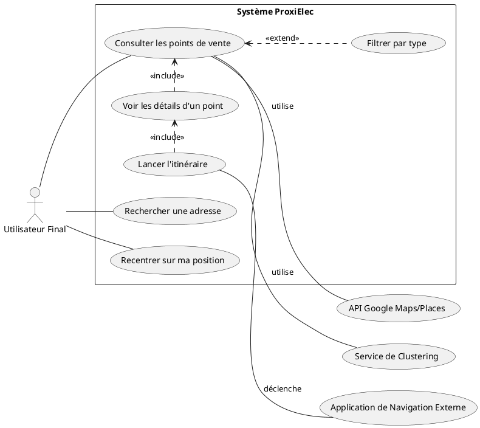
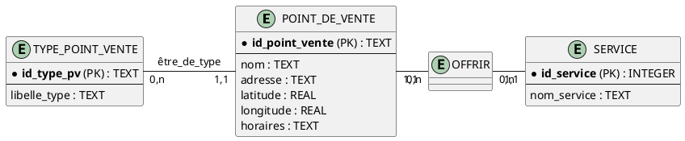
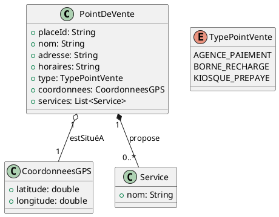
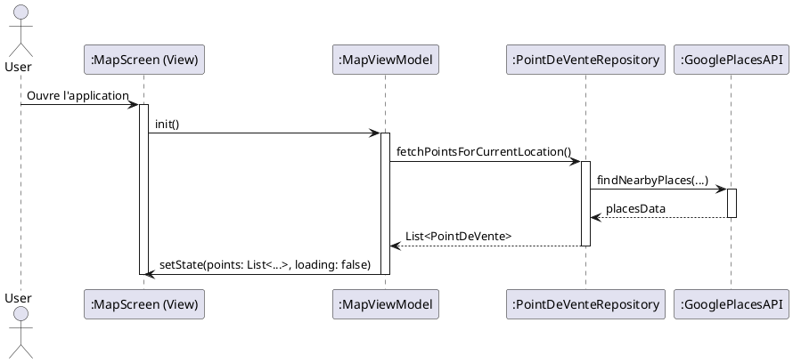
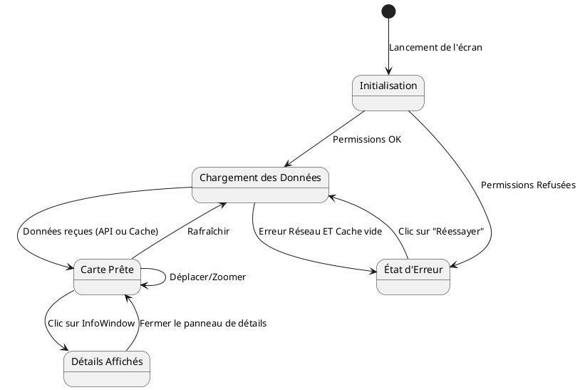

### **Livrable 2 : Dossier de Spécifications Fonctionnelles et Modélisation**

**Nom du Projet :** ProxiElec  
**Version du Document :** 1.0  
**Date :** 17 septembre 2025  
**État :** Finalisé

---

#### **Table des Matières**
1.  [Catalogue des Exigences Fonctionnelles](#1-catalogue-des-exigences-fonctionnelles)
2.  [Modélisation par Cas d'Utilisation (Approche UML)](#2-modélisation-par-cas-dutilisation-approche-uml)
    *   2.1. Diagramme des Cas d'Utilisation
    *   2.2. Description Détaillée du Cas d'Utilisation Principal
3.  [Modélisation des Données (Approche Merise & UML)](#3-modélisation-des-données-approche-merise--uml)
    *   3.1. Modèle Conceptuel des Données (MCD - Merise)
    *   3.2. Diagramme de Classes du Domaine (UML)
4.  [Modélisation Dynamique et des Traitements](#4-modélisation-dynamique-et-des-traitements)
    *   4.1. Modèle Conceptuel des Traitements (MCT - Merise)
    *   4.2. Diagramme de Séquence UML (Scénario Nominal)
    *   4.3. Diagramme d'États-Transitions UML (Écran Principal)

---

### **1. Catalogue des Exigences Fonctionnelles**

| ID      | Nom de l'Exigence                | Description Détaillée                                                                                                                                                                                            |
| :------ | :------------------------------- | :--------------------------------------------------------------------------------------------------------------------------------------------------------------------------------------------------------------- |
| **BF-01** | **Géolocalisation de l'Utilisateur** | Le système doit être capable de demander les permissions nécessaires pour accéder à la localisation de l'appareil. Si accordées, il doit obtenir les coordonnées GPS actuelles de l'utilisateur.             |
| **BF-02** | **Affichage sur Carte**            | Le système doit afficher une carte interactive (Google Maps) comme interface principale. La position de l'utilisateur doit y être matérialisée par un marqueur distinctif.                                     |
| **BF-03** | **Recherche et Affichage à Proximité** | Le système doit automatiquement interroger une source de données pour récupérer les points de vente situés dans la zone géographique visible de la carte et les afficher sous forme de marqueurs.          |
| **BF-04** | **Regroupement des Marqueurs**     | Pour garantir la lisibilité, le système doit regrouper les marqueurs géographiquement proches en un "cluster" lorsque le niveau de zoom est faible. Le cluster doit indiquer le nombre de points qu'il contient. |
| **BF-05** | **Filtrage par Type**              | L'utilisateur doit disposer d'une interface (ex: puces de sélection) pour filtrer les points de vente affichés sur la carte selon leur type (Agence de paiement, Borne de recharge VE, Kiosque prépayé).        |
| **BF-06** | **Consultation des Détails**       | Au clic sur un marqueur, le système doit d'abord afficher une InfoWindow avec le nom du point. Au clic sur l'InfoWindow, un panneau de détails doit s'afficher avec les informations complètes (nom, adresse, horaires, distance, services). |
| **BF-07** | **Calcul et Lancement d'Itinéraire** | Depuis le panneau de détails, le système doit proposer une action pour lancer l'application de navigation par défaut de l'appareil avec les coordonnées du point de vente comme destination.         |
| **BF-08** | **Recherche Manuelle d'Adresse**   | L'utilisateur doit disposer d'un champ de recherche pour saisir une adresse ou un nom de ville, afin de déplacer la carte et d'explorer les points de vente dans cette nouvelle zone.                         |
| **BF-09** | **Gestion des États**              | Le système doit fournir un retour visuel clair à l'utilisateur pour les différents états : chargement des données, absence de connexion internet, erreur de localisation, aucun résultat trouvé.         |

### **2. Modélisation par Cas d'Utilisation (Approche UML)**

#### **2.1. Diagramme des Cas d'Utilisation**

#### **2.2. Description Détaillée du Cas d'Utilisation Principal**
*   **ID :** CU-01
*   **Nom :** Consulter les points de vente
*   **Acteur Principal :** Utilisateur Final
*   **Préconditions :** Le smartphone est allumé et dispose d'une connexion internet.
*   **Postconditions :** L'utilisateur a visualisé les points de vente sur la carte et a pu accéder aux détails de l'un d'entre eux.
*   **Scénario Nominal :**
    1.  L'Utilisateur lance l'application ProxiElec.
    2.  Le Système demande l'autorisation d'accéder à la localisation (si nécessaire).
    3.  L'Utilisateur accorde l'autorisation.
    4.  Le Système obtient la position GPS et centre la carte sur celle-ci.
    5.  Le Système récupère et affiche les points de vente à proximité sous forme de clusters/marqueurs.
    6.  L'Utilisateur zoome/se déplace sur la carte ; le Système met à jour les points affichés.
    7.  L'Utilisateur appuie sur un marqueur.
    8.  Le Système affiche une InfoWindow avec le nom du point.
    9.  L'Utilisateur appuie sur l'InfoWindow.
    10. Le Système affiche le panneau de détails complet.

### **3. Modélisation des Données (Approche Merise & UML)**

#### **3.1. Modèle Conceptuel des Données (MCD - Merise)**

*   **Description :** Chaque `POINT_DE_VENTE` est obligatoirement d'un seul `TYPE_POINT_VENTE`. Un `POINT_DE_VENTE` peut proposer de zéro à plusieurs `SERVICE`s, et un `SERVICE` peut être proposé par plusieurs points de vente (relation `OFFRIR`).

#### **3.2. Diagramme de Classes du Domaine (UML)**

*   **Description :** Ce diagramme est l'équivalent orienté objet du MCD. Il montre les entités comme des classes avec leurs attributs et les relations de composition et d'agrégation.

### **4. Modélisation Dynamique et des Traitements**

#### **4.1. Modèle Conceptuel des Traitements (MCT - Merise)**
*   **Événement :** L'utilisateur lance l'application.
*   **Processus 1 : Initialisation de la carte**
    *   **Opération 1.1 :** Obtenir la localisation (conditionnée par les permissions et l'état du GPS).
    *   **Opération 1.2 :** Récupérer les points de vente (conditionnée par la connectivité réseau ; utilise l'API ou le cache).
    *   **Résultat :** Carte initialisée avec la position et les points affichés.
*   **Événement :** L'utilisateur interagit avec la carte (déplacement, clic, etc.).
*   **Processus 2 : Interaction**
    *   **Opération 2.1 :** Mettre à jour les points de vente (si déplacement).
    *   **Opération 2.2 :** Afficher les détails d'un point (si clic).
    *   **Résultat :** Interface mise à jour en temps réel.

#### **4.2. Diagramme de Séquence UML (Scénario Nominal)**

#### **4.3. Diagramme d'États-Transitions UML (Écran Principal)**
